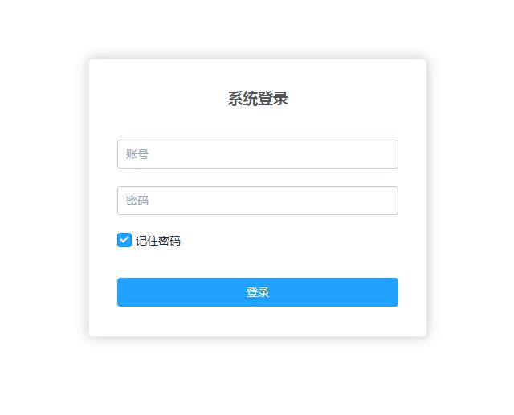
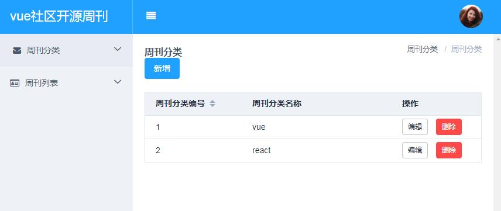
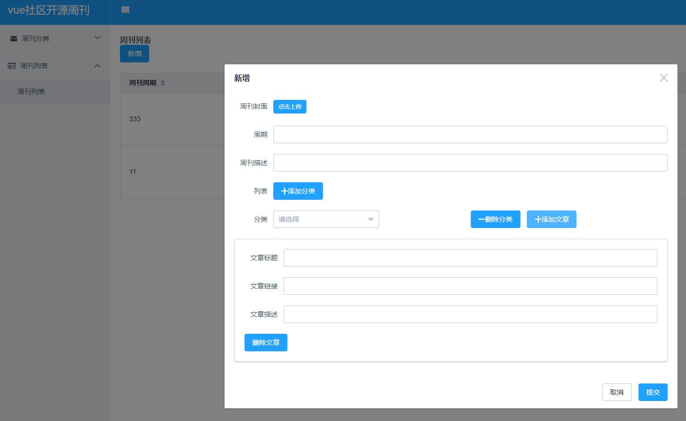
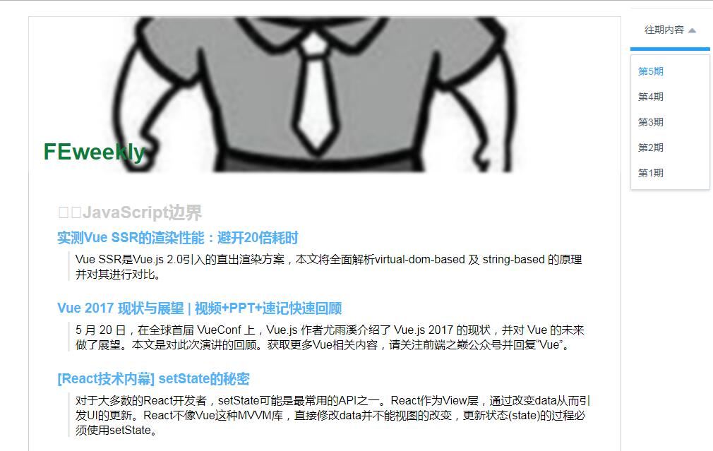

# weeklyPlus 中文文档

## 项目描述

weeklyPlus vue中文社区周刊服务端渲染升级版 [weeklyPlus](https://github.com/wuyanwen/weeklyPlus/)

## 引言

* 为什么要做一个这样的weeklyPlus系统?
* 可以做为知识的沉淀
* 可以熟悉最前沿且不仅限于前端的最新知识
* 可以传播到更多的需要这些知识的同学们
* 圈内已经有很多weekly系统了，weeklyPlus有什么不同吗?
* 我们保证是有态度（不求多，只求精）的周刊
* 我们保证发的每一篇文章都是有意义的
* 我们是open source ，欢迎每一位同学添砖加瓦

## 技术栈
* [nuxt](https://github.com/nuxt/nuxt.js) - vue 服务端渲染框架
* [vue-cli](https://github.com/vuejs/vue-cli) - Vue.js 提供的官方命令行工具，可用于快速搭建大型单页应用
* [mongodb](https://www.mongodb.com/) - 数据库
* [koa](http://koajs.com/) -  公开 API 接口
* [element-ui](http://element.eleme.io/#/zh-CN) - 基础组件库
* [axios](https://github.com/mzabriskie/axios) - http 请求
 web 应用
## 功能

* 周刊系统列表
* 周刊后台权限控制
* 周刊后台登录功能
* 周刊后台分类增删改查功能
* 周刊后台内容增删改查功能


## 开发部署

``` bash
# 1. 切换到server文件夹,依次执行以下命令
$ npm install 
$ npm run start

# 2. 切换到admin文件夹,依次执行以下命令
$ npm install 
$ npm run start

# 3. 切回到项目根目录,
$ npm install 
$ npm run dev
```

## 最后

欢迎 issue 和 pr
## 部分功能截图




